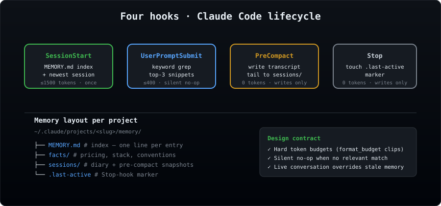

# 🧠 Hustlers MegaMind

> **Persistent memory layer for Claude Code.** Token-efficient. Local. Zero deps. Yours.

[](https://github.com/hustlerv369/hustlers-megamind/actions/workflows/test.yml)
[](LICENSE)
[](https://www.python.org/)
[](#design-principles-the-token-safety-contract)

Between sessions, MegaMind remembers so you don't have to re-explain.
What went into your project yesterday ships with tomorrow's first prompt —
without you lifting a finger.







---

## Why this exists

Claude Code opens every new session with **zero knowledge** of what happened
before. Project facts, past decisions, last session's conclusions — gone.
You re-explain every time. That costs:

- **Tokens** (~2–8k wasted per session on re-context)
- **Time** (typing out "remember we had this bug yesterday…")
- **Precision** (you often forget critical details Claude had last time)

Paid alternatives exist (MemStack Pro — $29 one-time, 114 skills bundled).
They're good. They're also closed-source and ship a lot you don't need.

MegaMind is the **free, local, hackable** memory layer. Built in one
evening. Around 400 lines of Python, stdlib only.

---

## What it does

Four hooks registered in `~/.claude/settings.json` fire on Claude Code
lifecycle events and inject relevant memory context — or silently do
nothing when there's nothing to inject.

| Hook | When | Action | Token cost |
|------|------|--------|-----------|
| **SessionStart** | New / resumed / cleared session | Injects `MEMORY.md` index + newest session note | ≤1500 tokens, once per session |
| **UserPromptSubmit** | Every user message | Greps memory files for keywords, injects top-3 matches | ≤400 tokens per prompt, **silent** when no hit |
| **PreCompact** | Auto-compaction triggers | Saves transcript tail to `sessions/compact-*.md` — **writes only**, no inject | 0 tokens |
| **Stop** | Claude finishes responding | Updates `.last-active` marker | 0 tokens |

---

## Token economics

**Without MegaMind**, a typical working session starts with you re-explaining:
*"Remember that auth bug? It was the cookie SameSite attribute, and the
refresh endpoint wasn't stripping the old token, and we ended up patching
the middleware too…"*
That's ~2000 tokens before real work starts. Multiply by 3–5 sessions/day.

**With MegaMind**, SessionStart auto-loads ~1000 tokens of context, and
every prompt costs ~300 extra tokens only when it matches memory.

| Scenario | Without | With MegaMind |
|----------|---------|--------------|
| Daily re-explain context | 4,000–8,000 tokens | 1,000 (auto) |
| Per-prompt contextual recall | 500–2,000 tokens typed | 300 (hook, silent if no match) |
| Across a week of work | ~30,000 tokens wasted | ~7,000 overhead, **~23,000 saved** |

Break-even: 3 user messages. Everything after is pure savings.

---

## Quick start — three-minute setup

Tell Claude Code:

> *"Install MegaMind and set up my private memory vault."*

Claude will run, in order:

```bash
# 1. Get the skill + register hooks
git clone https://github.com/hustlerv369/hustlers-megamind ~/.claude/skills/megamind
python ~/.claude/skills/megamind/scripts/install.py

# 2. Create your PRIVATE memory-vault repo on GitHub + enable autosync
python ~/.claude/skills/megamind/scripts/cli.py sync auto-setup

# 3. Confirm it's live
python ~/.claude/skills/megamind/scripts/cli.py status
python ~/.claude/skills/megamind/scripts/cli.py sync auto-status
```

The second step needs the [`gh` CLI](https://cli.github.com/) logged in
(`gh auth login`). It creates `<your-account>/memory-vault` as a **private**
repo. Your project facts, decisions, and session notes go there — **never**
to this public skill repo. After this, autosync pulls on every new session
and pushes after each Claude response (rate-limited).

---

## Daily use — talk to Claude in plain language

You don't need to learn the CLI. Once MegaMind is installed, just talk
to Claude. Claude reads `SKILL.md` and maps natural language to the
right command. Examples that work out of the box:

| Say this to Claude | Claude does this |
|--------------------|------------------|
| *"Save this to MegaMind: we decided to use Postgres, not MySQL."* | Appends a one-liner to `MEMORY.md`, autosync uploads to your private `memory-vault` repo |
| *"Remember that the staging URL is staging.example.com."* | Same — fact stored + auto-synced |
| *"What did we do last session?"* | Recalls the newest session note from memory |
| *"Search memory for Stripe webhook."* | Runs `cli.py recall "Stripe webhook"` and summarizes matches |
| *"Forget the old pricing fact."* | Removes the matching MEMORY.md line |
| *"How many tokens did MegaMind save me?"* | Prints `cli.py stats` |
| *"Audit my memory for leaked secrets."* | Runs `cli.py audit` (15 secret patterns) |
| *"Init memory for this project with the Next.js template."* | `cli.py init --template nextjs-saas` |
| *"Push memory now."* / *"Pull latest memory."* | `cli.py sync push` / `cli.py sync pull` |

Localized triggers (Czech / English) are listed in `SKILL.md` — Claude
recognizes both.

### What MegaMind already does without you asking

- **Every new session** — auto-loads `MEMORY.md` + the newest session note (≤1500 tokens)
- **Every prompt** — silently greps memory for relevant context (≤400 tokens, silent if no hit)
- **Before compaction** — saves the transcript tail to `sessions/compact-*.md` so the next session can pick up
- **After Claude responds** — auto-commits + pushes your memory to the vault (rate-limited to once per 10 min)

You only need explicit "save this to MegaMind" calls when you want a
specific fact captured **right now** that Claude wouldn't otherwise
identify as long-term-relevant.

---

## Install

### From GitHub (recommended for first-time users)

```bash
git clone https://github.com/hustlerv369/hustlers-megamind ~/.claude/skills/megamind
python ~/.claude/skills/megamind/scripts/install.py
```

### If the skill folder is already on disk

```bash
python ~/.claude/skills/megamind/scripts/install.py
```

The installer:
1. Registers 4 hooks in `~/.claude/settings.json`
2. Backs up the previous settings as `settings.json.bak-<timestamp>`
3. Coexists with your existing hooks (doesn't clobber)

Restart Claude Code (or open a new session) for hooks to take effect.

### Verify install

After restarting Claude Code, confirm everything is wired up:

```bash
python ~/.claude/skills/megamind/scripts/cli.py status
```

You should see your project slug + memory dir path. If the dir doesn't
exist yet (you've never run a session in this project after install),
bootstrap one with:

```bash
python ~/.claude/skills/megamind/scripts/cli.py init
# or seed with a starter template:
python ~/.claude/skills/megamind/scripts/cli.py init --template nextjs-saas
```

You can also confirm the hooks were written by inspecting
`~/.claude/settings.json` — there should be entries pointing at
`megamind/scripts/hook_*.py` under each of the four lifecycle keys.

### Uninstall

```bash
python ~/.claude/skills/megamind/scripts/install.py --uninstall
```

Removes only MegaMind entries, leaves everything else untouched.

---

## Directory layout

### Skill itself (installed once, globally)

```
~/.claude/skills/megamind/
├── SKILL.md                        # skill metadata (discoverable via Skill tool)
├── README.md                       # this file
└── scripts/
    ├── lib.py                      # shared utilities (slug resolution, keyword grep, budget enforcement)
    ├── hook_session_start.py       # SessionStart hook runner
    ├── hook_user_prompt.py         # UserPromptSubmit hook runner
    ├── hook_pre_compact.py         # PreCompact hook runner
    ├── hook_stop.py                # Stop hook runner
    ├── cli.py                      # on-demand: status / recall / list / sync / …
    ├── sync.py                     # optional git-backed cross-device vault
    └── install.py                  # idempotent registrator / uninstaller
```

### Per-project data (Claude Code's standard layout)

```
~/.claude/projects/<project-slug>/memory/
├── MEMORY.md                       # index — list of files with one-liners
├── facts/                          # long-lived facts (pricing, stack, credentials patterns)
│   ├── pricing.md
│   └── tech-stack.md
├── sessions/                       # session diaries + pre-compact snapshots
│   ├── 2026-04-17-night-session.md
│   └── auto-2026-04-18-0312-compact-auto.md
└── .last-active                    # timestamp stamp updated by Stop hook
```

Project slug mirrors Claude Code's internal slugification:
`D:\CLAUDE\my-project` → `D--CLAUDE-my-project`. Worktrees auto-fallback
to their parent project's memory.

A reference `MEMORY.md` plus example `facts/` and `sessions/` files live
in [`examples/`](examples/) — copy any of them into your project's memory
dir as a starting point.

---

## Design principles (the token-safety contract)

### 1. Hard budgets, enforced

Every hook has a char budget (characters ≈ tokens / 4). `format_budget()`
hard-clips output with a `[...truncated]` tail when exceeded.

```python
BUDGET_SESSION_START = 6000       # ~1500 tokens
BUDGET_USER_PROMPT = 1600         # ~400 tokens
BUDGET_SNIPPET = 600              # ~150 tokens per file
```

All live in `scripts/lib.py` as module-level constants. Edit to tune.

### 2. Silent no-op by default

- Fewer than 2 keywords ≥4 chars in a prompt → **no inject** (low signal)
- No memory dir for this project → **no inject**
- No keyword hit in any file → **no inject**

MegaMind never pads context with filler like *"no relevant memory found"*.

### 3. Live conversation wins

SessionStart includes this preamble:

> *"If anything here contradicts what the user is saying now, the live
> conversation wins, but mention the discrepancy."*

Stale memory never overrides fresh user input.

### 4. Grep-first, vector-later

Search is keyword-based via Python `re.findall` + `str.count` scoring.
Fast for <1000 files, always fresh, zero index maintenance. A SQLite FTS5
backend is planned for scale but **not needed for typical single-project
memory** (tens of files, thousands of tokens total).

### 5. Zero external dependencies

Python 3.7+ stdlib only: `sqlite3`, `pathlib`, `re`, `json`, `os`, `sys`.
No `pip install`, no venv, no npm. Runs on Windows (Git Bash), macOS,
Linux. UTF-8 stdout forced at lib-load time — emoji and Czech chars don't
crash Windows cp1250.

---

## CLI

On-demand memory ops via `cli.py`. Full subcommand list:

```bash
python cli.py status                      # memory dir + size
python cli.py stats                       # hook fire counts + token savings estimate
python cli.py list                        # all memory files, newest first
python cli.py recall <query>              # search memory, print top matches
python cli.py remember <text>             # append a one-line fact to MEMORY.md
python cli.py forget <keyword>            # remove matching MEMORY.md line(s)
python cli.py audit                       # scan memory files for leaked secrets
python cli.py init [--template <name>]    # bootstrap memory (optionally from template)
python cli.py templates                   # list available starter templates
```

> Tip: from anywhere on disk, prefix the command with the absolute path:
> `python ~/.claude/skills/megamind/scripts/cli.py status`. The shorter
> `python cli.py …` form assumes your shell is `cd`'d into `scripts/`.

### Examples

```bash
# Bootstrap a Next.js SaaS project with a pre-filled memory skeleton
python cli.py init --template nextjs-saas

# Quick-add a fact without opening a file
python cli.py remember "user prefers terse Czech replies"
# → ✅  remembered: - 📦 [2026-04-20] user prefers terse Czech replies

# Measure what MegaMind has saved you
python cli.py stats
# → ┌──────────────────────────────────────────────────────┐
#   │  🧠  MegaMind stats                                   │
#   ├──────────────────────────────────────────────────────┤
#   │  SessionStart fires:    14                           │
#   │  UserPrompt — hit:      47                           │
#   │  UserPrompt — silent:   23                           │
#   │  PreCompact saves:      2                            │
#   ├──────────────────────────────────────────────────────┤
#   │  💾  Tokens saved (est): 42,700 tokens               │
#   └──────────────────────────────────────────────────────┘

# Defensive scan — did a secret slip in?
python cli.py audit
# → 🟢  audit clean — no secret-looking patterns in memory

# Forget something that was auto-remembered but turned out wrong
python cli.py forget "shopify"
```

### Available starter templates

| Template | For |
|----------|-----|
| `nextjs-saas` | Next.js SaaS with Stripe billing |
| `python-api` | FastAPI / Flask / Django backend |
| `react-native` | React Native / Expo mobile app |
| `data-pipeline` | Airflow / dbt / Dagster data platform |
| `seo-site` | Content / SEO / marketing site |

Each template seeds a `MEMORY.md` index and 1–3 `facts/*.md` skeletons
with placeholders you fill in as you ship.

---

## How hooks actually plug in

Claude Code reads `~/.claude/settings.json` on startup and fires shell
commands at each lifecycle event. The stdin of each hook receives a JSON
payload with at minimum `cwd`, `hook_event_name`, and (for prompt hooks)
the user's text. Hooks write stdout → Claude Code injects it into the
conversation context as `additionalContext`.

Example registration (what `install.py` writes):

```json
{
  "hooks": {
    "SessionStart": [
      {
        "hooks": [
          {
            "type": "command",
            "command": "python \"/home/alex/.claude/skills/megamind/scripts/hook_session_start.py\""
          }
        ]
      }
    ],
    "UserPromptSubmit": [
      {
        "hooks": [
          {
            "type": "command",
            "command": "python \"/home/alex/.claude/skills/megamind/scripts/hook_user_prompt.py\""
          }
        ]
      }
    ]
  }
}
```

Coexists side-by-side with your existing bash hooks — the installer drops
only MegaMind entries on re-run, never touches other slots.

---

## Writing memory files

MegaMind doesn't enforce a schema — anything in `~/.claude/projects/<slug>/memory/*.md`
gets indexed. Some conventions that work well in practice:

**Index (`MEMORY.md`)** — one-line entries with a tag and link:
```markdown
- 🔴 [TOMORROW: run the prod migration](tomorrow_migration.md) — window is 07:00 UTC, rollback plan ready
- ✅ [Auth bug FIXED](auth_cookie_fix.md) — SameSite=None root cause, 2 spots patched
- 📓 [Session 2026-04-17](sessions/2026-04-17-session.md) — added rate limiter, Sentry wired up
- [Product facts](product_facts.md) — pricing, supported regions, where to verify before external copy
```

Leading emoji helps Claude prioritize:
- 🔴 urgent / pending next session
- ✅ resolved / reference
- 📓 session note
- (no emoji) stable project fact

**Facts (`facts/<topic>.md`)** — front-matter + markdown:
```markdown
---
name: Product pricing facts
date: 2026-04-17
verify_before_citing: ['/pricing', 'billing provider dashboard']
---

## Plans
- FREE: $0
- PRO: $9/mo, $89/yr. 7-day trial on both cycles.
- TEAM: $29/mo, $290/yr. No trial.
```

**Sessions (`sessions/YYYY-MM-DD-title.md`)** — free-form diary:
```markdown
# Session 2026-04-17 — payment webhook fix

## What shipped
- Payment webhook signature verification fixed (2 bugs)
- Trial extension rolled out
- MegaMind installed

## Next session
- Monitor webhook retries in dashboard
- E2E signup test with QA
```

Reference copies of all three live in [`examples/`](examples/).

---

## Other memory projects in the Claude Code ecosystem

We're not alone. There's a growing ecosystem of persistent-memory tools
for Claude Code, each with a different angle. Here's where MegaMind fits.

| Project | Angle | Trade-off vs MegaMind |
|---------|-------|----------------------|
| [claude-mem](https://github.com/thedotmack/claude-mem) | Auto-captures everything, compresses with Claude Agent SDK | Uses LLM calls from hooks (extra tokens + latency + API key needed) |
| [claude-memory-compiler](https://github.com/coleam00/claude-memory-compiler) | LLM compiler organizes sessions into knowledge articles | Heavier (Agent SDK dep), auto-structures what you might prefer to curate |
| [Hivemind](https://github.com/activeloopai/hivemind) | Cloud-backed shared memory via Deeplake | Requires cloud account, network dependency |
| [Meridian](https://github.com/GigaClaude/meridian) | Local LLM synthesis, three-tier storage | Needs GPU for local model, more ambitious scope |
| [claude-supermemory](https://github.com/supermemoryai/claude-supermemory) | Third-party Supermemory service | Vendor lock-in, external service dependency |
| [claude-code-memory-setup](https://github.com/lucasrosati/claude-code-memory-setup) | Obsidian + knowledge graphs (Graphify) | Locks you into Obsidian workflow |

**Where Hustlers MegaMind fits:** the simplest possible memory layer that
still actually works. No LLM calls from hooks. No cloud. No GPU. No
Obsidian. Pure Python stdlib + grep. If you want the minimum viable
persistent memory — this is it.

## Comparison to MemStack Pro

| Feature | MemStack Pro | Hustlers MegaMind |
|---------|:------------:|:------------:|
| Persistent memory between sessions | ✅ | ✅ |
| Auto-load at session start | ✅ | ✅ |
| Smart context injection per prompt | ✅ (vector) | ✅ (keyword grep) |
| Transcript preservation before compaction | ✅ | ✅ |
| Token budget enforcement | ✅ | ✅ (configurable) |
| Cost | $29 one-time | $0 |
| License | Proprietary | MIT (planned) |
| Lines of code | 112 skills, unknown LOC | ~400 LOC |
| Dependencies | Python + optional extras | Python stdlib only |
| Hackability | Limited (closed source) | Full (all files editable) |
| Bundled extras | 110+ workflow skills (deployment, content, security) | 0 — memory only |

**Use MemStack Pro** if you want the bundled workflow skills (content
creation, deployment templates, security audits) and a polished turnkey
experience.

**Use Hustlers MegaMind** if you want memory that's local, readable,
modifiable, zero-dependency, free forever.

---

## Roadmap

### Shipped in v0.1
- ✅ Four core hooks (SessionStart, UserPromptSubmit, PreCompact, Stop)
- ✅ Keyword grep + hard token budgets
- ✅ `cli.py remember / forget / recall` — no-editor fact management
- ✅ `cli.py stats` — hook fire counts + token savings estimate
- ✅ `cli.py audit` — secrets scanner (15 patterns: Stripe, OpenAI, Anthropic, AWS, GitHub, JWT, private keys, etc.)
- ✅ `cli.py init --template <name>` — five starter templates

Full version history → [CHANGELOG.md](CHANGELOG.md).
Public direction → [ROADMAP.md](ROADMAP.md).

### v0.2 — next
- **SQLite FTS5 backend** — replace linear grep for projects with 100+ memory files
- **Drift detection** — warn when memory claims diverge from code constants
- **Cross-project recall** — `recall --all` searches every project
- **Consolidation skill** — merge duplicate facts, prune stale session notes
- **Tiered injection** — shorter prompts skip UserPromptSubmit entirely

### v0.3+ — optional semantic
- Optional local sentence-transformer behind a feature flag
- Hybrid ranking: FTS5 BM25 + embedding cosine

---

## Use MegaMind from anywhere — the memory vault

Memory on your laptop is useful. Memory on **every** machine you touch, with
zero manual sync, is a different level of useful. MegaMind ships an optional
git-backed sync so `~/.claude/projects/*/memory/` follows you everywhere.

### One-shot setup (needs `gh` CLI, fully automated)

```bash
python ~/.claude/skills/megamind/scripts/cli.py sync auto-setup
```

This:
1. Creates a **private** GitHub repo named `memory-vault` on your account
2. Links `~/.claude/projects/` to it as the `origin` remote
3. Pushes your current memory
4. Enables **autosync** — auto-pulls on every SessionStart, auto-pushes after Claude responses (rate-limited to once per 10 min)

From that point on, your memory is always up to date on any machine where
Claude Code is installed. Open a fresh session → hook fires → git pulls →
Claude sees the latest memory from wherever you worked last.

### Manual setup (no `gh`, create the repo yourself)

```bash
# 1. Create a private repo on GitHub named memory-vault (web UI)
# 2. Point MegaMind at it:
python cli.py sync init git@github.com:<you>/memory-vault.git

# 3. First push
python cli.py sync push

# Autosync was enabled by init. To disable:
python cli.py sync auto-off
```

### On a new machine

```bash
git clone https://github.com/<you>/hustlers-megamind ~/.claude/skills/megamind
python ~/.claude/skills/megamind/scripts/install.py
python ~/.claude/skills/megamind/scripts/cli.py sync init git@github.com:<you>/memory-vault.git
python ~/.claude/skills/megamind/scripts/cli.py sync pull
```

All your memory, instantly ported.

### All `sync` commands (full reference)

| Command | What it does |
|---------|--------------|
| `sync auto-setup [--repo-name <name>] [--public]` | One-shot via `gh` CLI: create private (default) repo, link, first push, enable autosync. `--public` makes it public; `--repo-name` overrides the default `memory-vault`. |
| `sync init <remote-url> [--branch <name>] [--no-autosync]` | Manual: link an existing repo as the vault remote. Default branch is `main`. `--no-autosync` skips enabling autosync after init. |
| `sync push [-m "<msg>"]` | Stage all memory changes, commit (default message is timestamped) and push to `origin`. No-op when there are no changes. |
| `sync pull` | `git pull --rebase --autostash` from `origin`. |
| `sync status` | Pending vault changes (`git status --short`). |
| `sync auto-on` | Enable background autosync (pull on SessionStart, push on Stop). |
| `sync auto-off` | Disable background autosync. |
| `sync auto-status` | Print autosync flag + vault initialization state. |

Rate limits (configured in `scripts/sync.py`):

- **SessionStart auto-pull:** at most once per 5 minutes
- **Stop auto-push:** at most once per 10 minutes

Both are silent on any failure (offline, auth prompt, conflict) so they
never break a Claude Code session.

### Where auto-sync actually works (honest table)

| Environment | Auto-pull on start | Auto-push on finish |
|-------------|:-:|:-:|
| Desktop/laptop with Claude Code | ✅ | ✅ |
| Dev box via SSH (Dispatch, Cursor remote) | ✅ | ✅ |
| Phone with Claude Code in Termux / iSH | ✅ | ✅ |
| **Phone Claude app** (official iOS/Android) | ⚠️ one paste | ✍️ not possible |
| **Web Claude** (browser on any machine) | ⚠️ one paste | ✍️ not possible |

For the last two, we ship a ready-made preamble at
[`assets/mobile-preamble.md`](assets/mobile-preamble.md) — save it as an
iOS Shortcut / Android text-expander / browser bookmarklet and it's
one-tap from anywhere.

### Safety guarantees

- The vault's `.gitignore` whitelists **only** `*/memory/` subfolders — nothing else in `~/.claude/projects/` (stats, backups, auth tokens) ever enters the repo.
- `.megamind-stats.json` is ignored (per-machine counter).
- Run `python cli.py audit` before your first push to scan for accidental secrets. Run it periodically after.
- Use a **private** repo. Never put your memory vault in a public repo.

---

## Testing & development

The repo ships **31 smoke tests** covering `lib.py`, `cli.py`, and
`sync.py`. The only test-time dependency is `pytest` itself — runtime is
still stdlib-only.

```bash
git clone https://github.com/hustlerv369/hustlers-megamind
cd hustlers-megamind
python -m pip install pytest
python -m pytest tests/ -v
```

CI runs the suite on a 3 × 3 matrix (Ubuntu / macOS / Windows × Python
3.9 / 3.11 / 3.12) — see
[`.github/workflows/test.yml`](.github/workflows/test.yml).

For the contribution flow, guiding principles (token-saving > token-spending;
zero deps; silent no-op default; under 1000 LOC; cross-platform), and
local style notes, see [CONTRIBUTING.md](CONTRIBUTING.md).

---

## Project documentation

| File | What it covers |
|------|----------------|
| [README.md](README.md) | This file — full overview, install, usage, design |
| [SKILL.md](SKILL.md) | Skill metadata for the Claude Code Skill tool |
| [CHANGELOG.md](CHANGELOG.md) | Version history (Keep a Changelog format) |
| [ROADMAP.md](ROADMAP.md) | Public direction: shipped / next / non-goals |
| [CONTRIBUTING.md](CONTRIBUTING.md) | How to propose changes |
| [SECURITY.md](SECURITY.md) | Vulnerability disclosure flow |
| [CODE_OF_CONDUCT.md](CODE_OF_CONDUCT.md) | Community standards |
| [`examples/`](examples/) | Reference `MEMORY.md`, session note, fact file |
| [`templates/`](templates/) | Five starter project templates |
| [`assets/mobile-preamble.md`](assets/mobile-preamble.md) | Paste-ready preamble for Claude mobile/web |

---

## Donate (optional, appreciated)

MegaMind is free forever. MIT license. No paid tier, no pro unlock,
no telemetry. If it saves you tokens and time and you want to send
a coffee (or a dinner — tokens add up), here's how:

<p align="center">
  <a href="https://revolut.me/hustlerv">
    
  </a>
</p>

<p align="center">
  <strong><a href="https://revolut.me/hustlerv">revolut.me/hustlerv</a></strong>
  &nbsp;·&nbsp;
  Scan the QR in the Revolut app
</p>

Any amount helps keep the project maintained. A note on what MegaMind
saved you (*"about 30k tokens this month"*) makes my day more than
the money does.

Not into Revolut? GitHub Sponsors and Ko-fi are on the roadmap —
[open an issue](https://github.com/hustlerv369/hustlers-megamind/issues)
if you'd like one prioritized.

---

## Security

Found a vulnerability? Please use GitHub's private advisory flow — see
[SECURITY.md](SECURITY.md). Do not file a public issue for security bugs.

---

## License

MIT. Free for commercial and personal use. Attribution appreciated but
not required.

---

## Author's note

Built in a single evening in April 2026 while shipping SEOKRATES — an
SEO platform for European markets. The day broke a stretch where we
re-explained the same project context to Claude Code three sessions in a
row. MegaMind is the answer so that never happens again.

If it helps you grind smarter, remember more, spend fewer tokens — send a
note. That's all the payment it needs.

— Hustler, 2026
